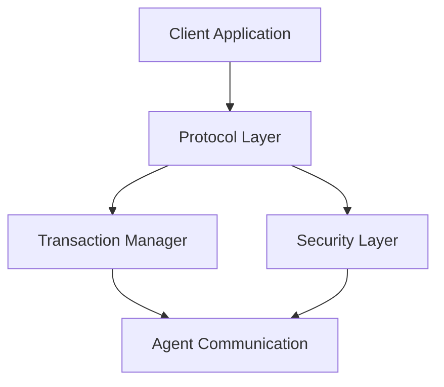

# Introduction

Welcome to the Agentic Transaction Protocol documentation!

## What is Agentic Transaction Protocol?

The Agentic Transaction Protocol is a modern framework designed to facilitate secure and efficient transactions between autonomous agents. It provides a standardized way for agents to communicate, negotiate, and execute transactions in a decentralized environment.

## Key Features

- **Secure**: Built with security best practices to ensure safe transactions
- **Efficient**: Optimized for high-performance operations
- **Flexible**: Adaptable to various use cases and scenarios
- **Standardized**: Following industry-standard protocols and conventions

## Getting Started

To get started with the Agentic Transaction Protocol, check out the following resources:

1. **Installation Guide**: Learn how to install and set up the protocol
2. **Quick Start**: Get up and running in minutes
3. **API Reference**: Detailed documentation of all available APIs
4. **Examples**: Real-world examples to help you understand the protocol

## Architecture Overview

The protocol is built on a modular architecture that allows for easy extension and customization:

## Why Use This Protocol?

- **Interoperability**: Works seamlessly with various agent frameworks
- **Scalability**: Designed to handle high transaction volumes
- **Developer-Friendly**: Easy-to-use APIs and comprehensive documentation
- **Community Support**: Active community and regular updates

## Next Steps

Ready to dive in? Head over to the [Getting Started](/docs/get-started) guide to begin your journey with the Agentic Transaction Protocol.
